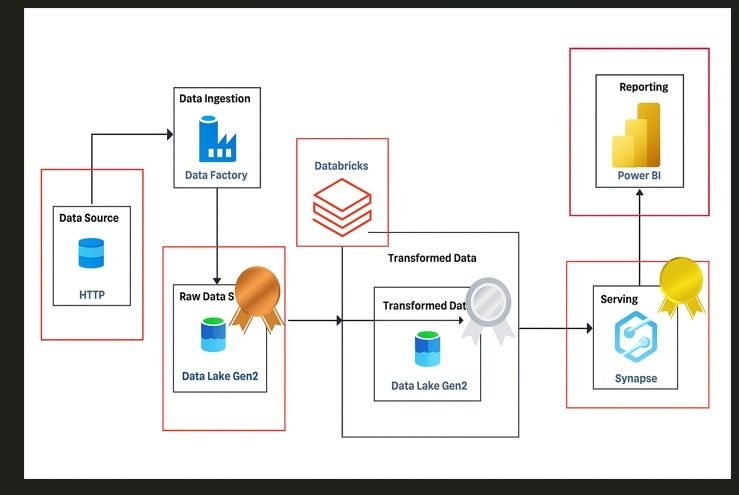
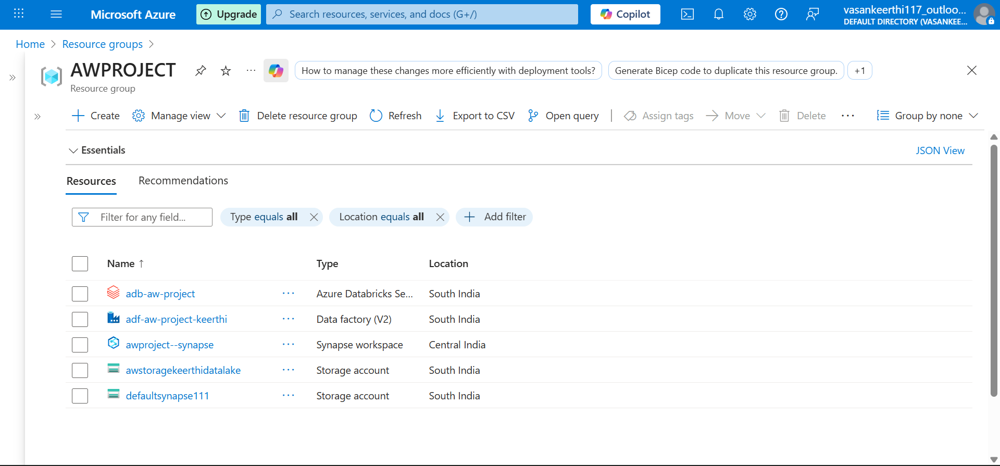
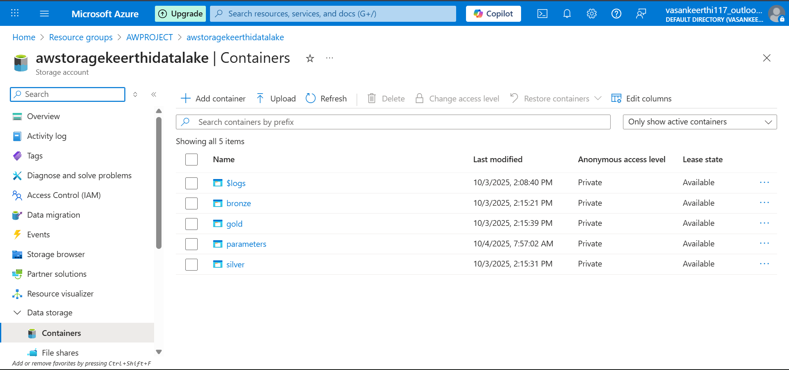
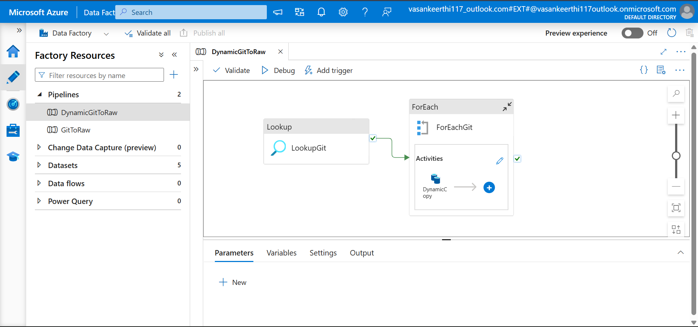
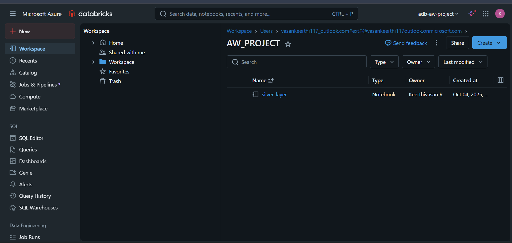
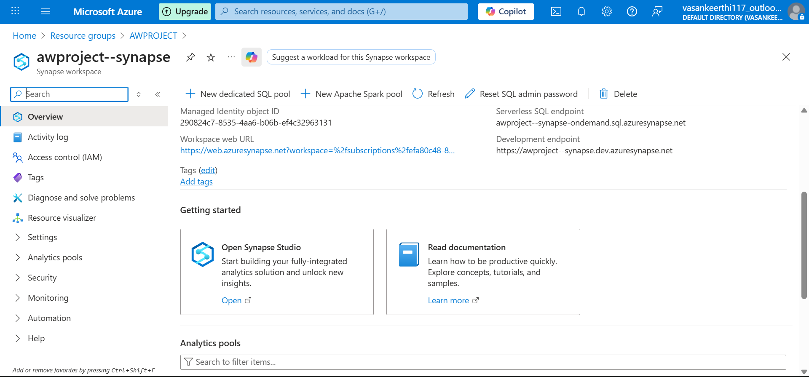
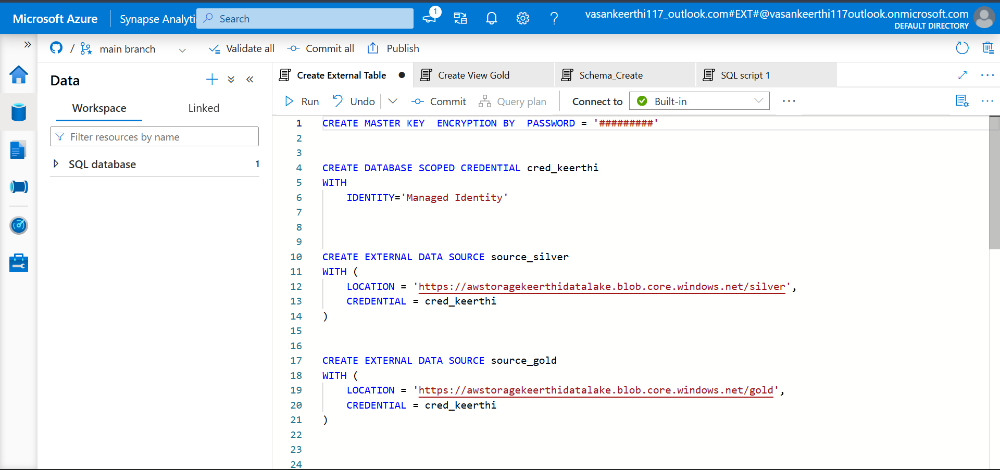
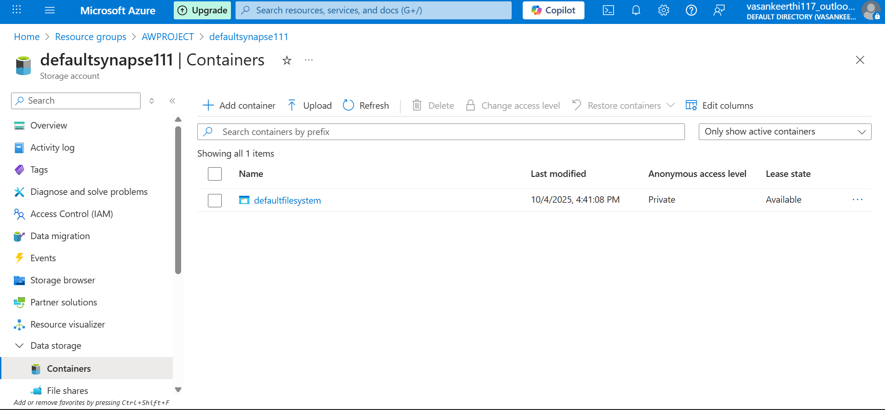

# Azure-and-synapse-analytics-end-to-end-project
##  Project Overview
# End-to-End Azure Data Engineering Project

## 🚀 Project Overview

This project demonstrates a complete data engineering pipeline built on Microsoft Azure, implementing a medallion architecture (Bronze, Silver, Gold) for data processing and analytics. The solution ingests raw data from Azure Blob Storage, processes it through Azure Data Factory and Databricks, and delivers insights through Azure Synapse Analytics.

## 🏗️ Architecture

### Data Engineering Architecture Diagram

*End-to-end data engineering architecture showing the flow from Azure Blob Storage through Azure Data Factory, Azure Databricks, Medallion layers, to Azure Synapse Analytics*

```
Azure Blob Storage (Raw Data)
        ↓
Azure Data Factory (Orchestration)
        ↓
Azure Databricks (Data Processing)
        ↓
Azure Blob Storage (Medallion Layers: Bronze/Silver/Gold)
        ↓
Azure Synapse Analytics (Data Warehouse & Analytics)
```

## 📸 Project Screenshots

### 1. Azure Resource Group Overview

*Overview of all Azure resources in the AWPROJECT resource group including Data Factory, Databricks, Synapse Analytics, and Storage Accounts*

### 2. Azure Blob Storage - Container Structure

*Medallion architecture implementation with Bronze, Silver, Gold, Parameters, and Logs containers*

### 3. Azure Data Factory - Pipeline Design

*DynamicGitToRaw pipeline with Lookup, ForEach, and Dynamic Copy activities for orchestrated data ingestion*

### 4. Azure Databricks Workspace

*Databricks workspace (AW_PROJECT) with silver_layer notebook for data transformation*

### 5. Azure Synapse Analytics - Overview

*Synapse workspace with serverless SQL endpoint and development endpoint configuration*

### 6. Synapse Analytics - SQL Script

*SQL scripts for creating external data sources, credentials, and external tables for Silver and Gold layers*

### 7. Storage Account - Default Synapse Container

*Default storage container for Synapse Analytics workspace*

## 🛠️ Technologies & Services Used

- **Azure Data Factory (ADF)**: Pipeline orchestration and data movement
- **Azure Blob Storage**: Data lake storage for raw and processed data
- **Azure Databricks**: Data transformation and processing
- **Azure Synapse Analytics**: Data warehousing and analytics
- **Resource Group**: AWPROJECT

## 📊 Data Flow

### 1. Data Ingestion Layer
- **Source**: Azure Blob Storage (`awstoragekeerthidatalake`)
  - Containers: `$logs`, `bronze`, `gold`, `parameters`, `silver`
- **Tool**: Azure Data Factory
  - Pipeline: `DynamicGitToRaw`
  - Activities: Lookup, ForEach, and Dynamic Copy operations

### 2. Data Processing Layer
- **Processing Engine**: Azure Databricks (`adb-aw-project`)
  - Workspace: AW_PROJECT
  - Notebook: `silver_layer`
  - Transform raw data into structured formats
  - Apply business logic and data quality rules

### 3. Data Storage Layer (Medallion Architecture)
- **Bronze Layer**: Raw data ingestion (as-is from source)
- **Silver Layer**: Cleaned and validated data
- **Gold Layer**: Business-level aggregations and analytics-ready data

### 4. Data Warehouse & Analytics Layer
- **Azure Synapse Analytics** (`awproject--synapse`)
  - Serverless SQL endpoint
  - Development endpoint
  - External tables created from Gold layer
  - Database: `SCOPED CREDENTIAL cred_keerthi`
  - External data sources: `source_silver`, `source_gold`

## 🔧 Key Components

### Azure Data Factory Pipeline
```
Pipeline: DynamicGitToRaw
├── LookupGit (Lookup Activity)
├── ForEachGit (ForEach Activity)
│   └── DynamicCopy (Copy Activity)
```

### Storage Account Structure
```
awstoragekeerthidatalake
├── bronze/
├── silver/
├── gold/
└── parameters/
```

### Synapse Analytics Setup
```sql
-- Master Key Creation
CREATE MASTER KEY ENCRYPTION BY PASSWORD = '##########'

-- Database Scoped Credential
CREATE DATABASE SCOPED CREDENTIAL cred_keerthi
WITH IDENTITY='Managed Identity'

-- External Data Sources
CREATE EXTERNAL DATA SOURCE source_silver
WITH (
    LOCATION = 'https://awstoragekeerthidatalake.blob.core.windows.net/silver',
    CREDENTIAL = cred_keerthi
)

CREATE EXTERNAL DATA SOURCE source_gold
WITH (
    LOCATION = 'https://awstoragekeerthidatalake.blob.core.windows.net/gold',
    CREDENTIAL = cred_keerthi
)
```

## 📁 Project Structure

```
AWPROJECT/
├── README.md
├── images/
│   ├── 00-architecture-diagram.png
│   ├── 01-resource-group.png
│   ├── 02-storage-containers.png
│   ├── 03-adf-pipeline.png
│   ├── 04-databricks-workspace.png
│   ├── 05-synapse-overview.png
│   ├── 06-synapse-sql-scripts.png
│   └── 07-default-synapse-storage.png
├── adf-pipelines/
│   └── DynamicGitToRaw.json
├── databricks-notebooks/
│   └── silver_layer.py
└── synapse-scripts/
    ├── create_external_tables.sql
    └── schema_create.sql
```

### Azure Resources
```
AWPROJECT/
├── adf-aw-project-keerthi (Data Factory V2)
├── adb-aw-project (Azure Databricks Service)
├── awproject--synapse (Synapse workspace)
├── awstoragekeerthidatalake (Storage account)
└── defaultsynapse111 (Storage account)
```

## 🎯 Features

- ✅ Dynamic and parameterized pipelines
- ✅ Incremental data loading
- ✅ Medallion architecture implementation
- ✅ Scalable data processing with Databricks
- ✅ Serverless analytics with Synapse
- ✅ Managed Identity for secure authentication
- ✅ External table creation for efficient querying

## 🔐 Security

- Managed Identity authentication between services
- Database scoped credentials in Synapse
- Private access level for storage containers
- Resource group level access control

## 📍 Region

- **Primary Region**: South India
- **Synapse Region**: Central India

## 🚦 Getting Started

### Prerequisites
- Azure subscription
- Appropriate permissions in Azure portal
- Basic knowledge of Azure services

### Setup Steps

1. **Create Resource Group**
   - Name: AWPROJECT
   - Region: South India

2. **Deploy Storage Account**
   - Create containers: bronze, silver, gold, parameters
   - Configure access policies

3. **Set up Azure Data Factory**
   - Create linked services to Blob Storage
   - Import pipeline JSON
   - Configure parameters

4. **Configure Databricks Workspace**
   - Create cluster
   - Import notebooks
   - Set up data lake access

5. **Deploy Synapse Analytics**
   - Create SQL database
   - Configure external data sources
   - Create external tables

## 📈 Use Cases

- Real-time data processing
- ETL/ELT workflows
- Data warehousing
- Business intelligence and reporting
- Data lake analytics

## 🎓 Learning Outcomes

Through this project, I gained hands-on experience with:
- Designing end-to-end data pipelines
- Implementing medallion architecture patterns
- Azure service integration and orchestration
- Serverless computing for cost optimization
- Data governance and security best practices

## 🤝 Contributing

Contributions are welcome! Please feel free to submit a Pull Request.

## 📧 Contact

**Developer**: Keerthivasan R  
**Project Location**: Salem, Tamil Nadu, India


⭐ If you find this project helpful, please give it a star!
